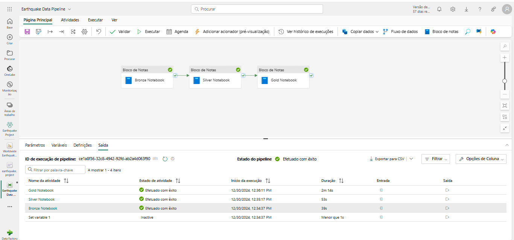
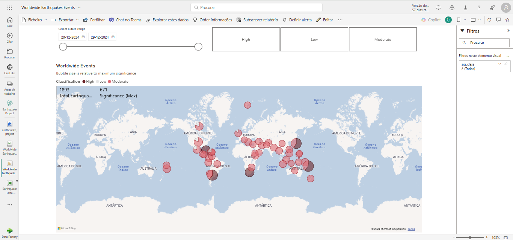

# 🌍 Real-Time Seismic Analytics with Microsoft Fabric


### 📋 Project Overview
This project focuses on building a complete **Data Engineering and Analytics pipeline** to process and analyze earthquake event data using **Microsoft Fabric**.

The pipeline begins with raw data ingestion from the [USGS API](https://earthquake.usgs.gov/), processes it through a Medallion Architecture (Bronze, Silver, Gold) using PySpark, and produces business-ready datasets for visualization in **Power BI**.

**Key Technologies:**
* **Computation:** Fabric Data Engineering (Spark/Python).
* **Orchestration:** Fabric Data Factory (Pipelines).
* **Visualization:** Power BI (DirectLake).

---

### 🏗️ Architecture Flow
The workflow moves data from raw ingestion to analytical readiness:


## Steps 

| File | Description |
| :--- | :--- |
| `01_ingestion_bronze.ipynb` | Connects to USGS API and saves raw JSON to OneLake. |
| `02_transform_silver.ipynb` | Cleans data, handles timestamps, and converts to Delta Parquet. |
| `03_aggregation_gold.ipynb` | Aggregates metrics (Magnitude by Region) for reporting. |


### USGS API - Bronze Layer Processing
1. Ingests raw earthquake data from the USGS API.
2. Minimal processing to store data in its original format.
3. Serves as the foundation layer for further refinement.

### USGS API - Silver Layer Processing

1. Enhances data from the bronze layer by cleaning, transforming and consolidating it.
2. Prepares data for analytical processing and deeper insights.

### USGS - Gold Layer Processing
1. Refines data from the Silver layer to create bussiness-ready datasets. A new environment was created to include the `reverse_geocoder` library, which is required for executing the Gold Layer processing. This ensures compatibility and smooth execution of the geographical data enhancement workflows.
2. Optimized for reporting and visualization, specifically designed for Power BI.


## Data Attibute Definitions
| **Attribute**        | **Description**                                                                 |
|-----------------------|---------------------------------------------------------------------------------|
| `id`                 | Unique identifier for each data record (string).                                |
| `latitude`           | Latitude of the event's location (double).                                      |
| `longitude`          | Longitude of the event's location (double).                                     |
| `elevation`          | Elevation at which the event occurred, in meters (double).                      |
| `title`              | Title or name of the earthquake event (string).                                 |
| `place_description`  | Description of the event’s location (string).                                   |
| `sig`                | Significance score of the event, indicating its importance (bigint).            |
| `mag`                | Magnitude of the earthquake (double).                                           |
| `magType`            | Type of magnitude scale used to measure the event (string).                     |
| `time`               | Timestamp indicating when the event occurred.                                   |
| `updated`            | Timestamp marking the most recent update to the event data.                     |


## Building the pipeline

### Setting Variables for Dynamic Data Extraction

To ensure that the pipeline always processes the most recent data, dynamic variables are configured for the start and end dates. These variables automatically ajust based on the current date at runtime:

`start_date`: Captures the date one day before the pipeline execution.
``` 
@formatDateTime(adddays(utcNow(),-1), 'yyyy-MM-dd')
```
`end_date`: Captures the current date at the time of pipeline execution.
```
@formatDateTime(utcNow(), 'yyyy-MM-dd')
```
 
 

## Dashboard - Power BI



